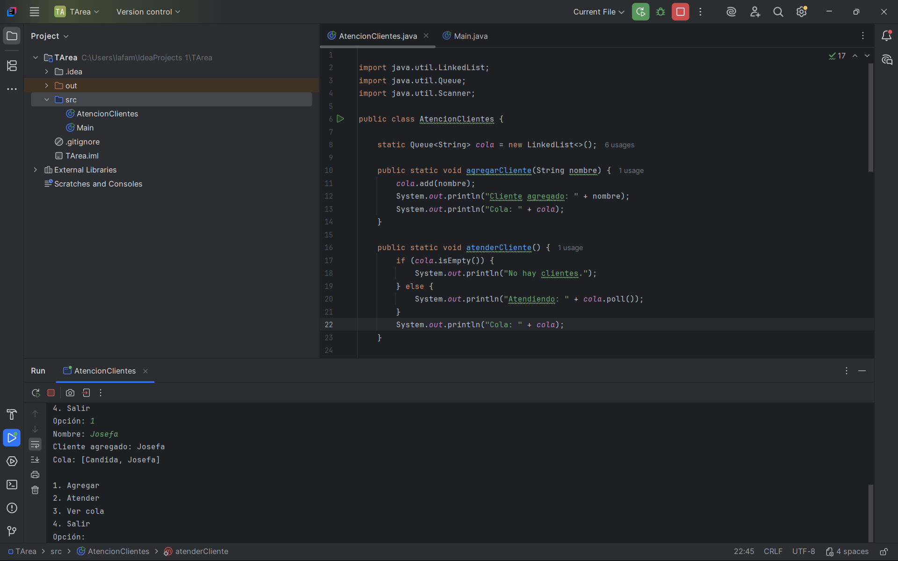
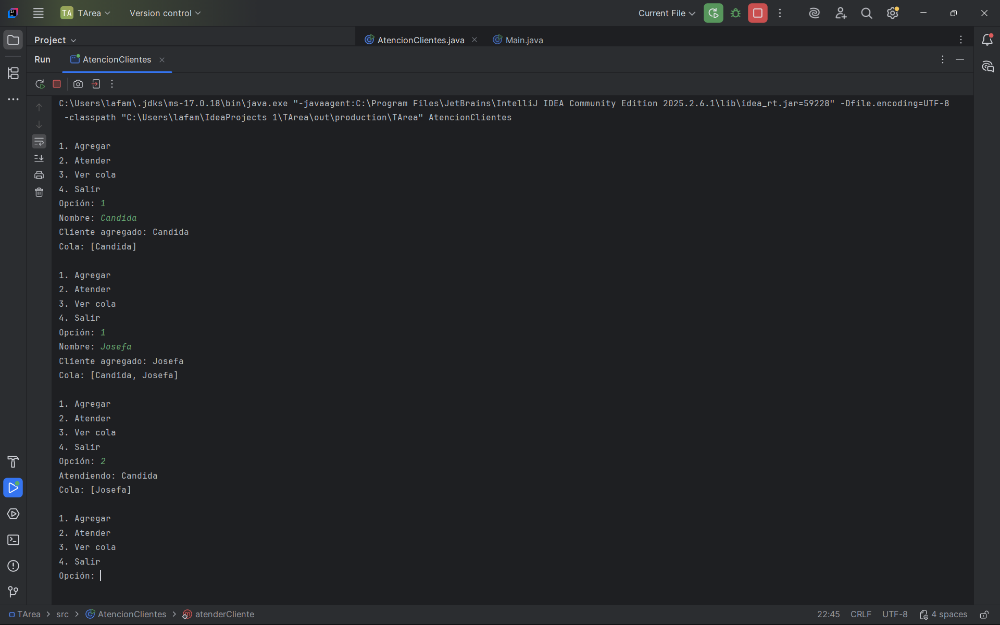
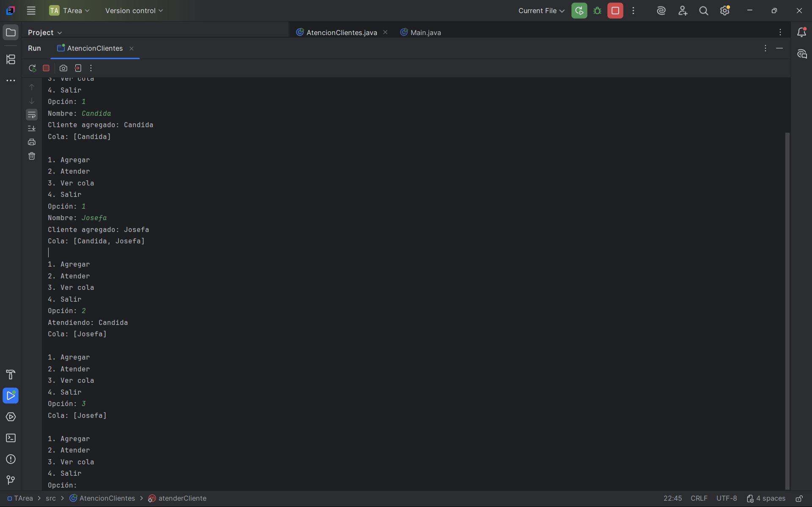
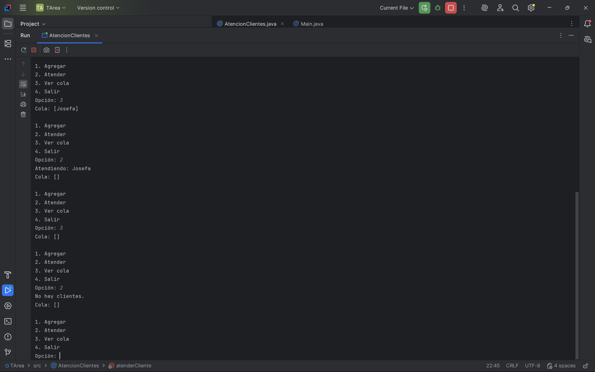

# Atencion-Clientes
Sistema de atencion al cliente en java 
# Sistema de Atención al Cliente

## Descripción
Programa en Java que simula una cola de clientes (FIFO).

## Funciones
- Agregar clientes
- Atender clientes
- Mostrar cola

## Autor
Juan Bautista Ramirez Salas 

## Evidencias
## Capturas

